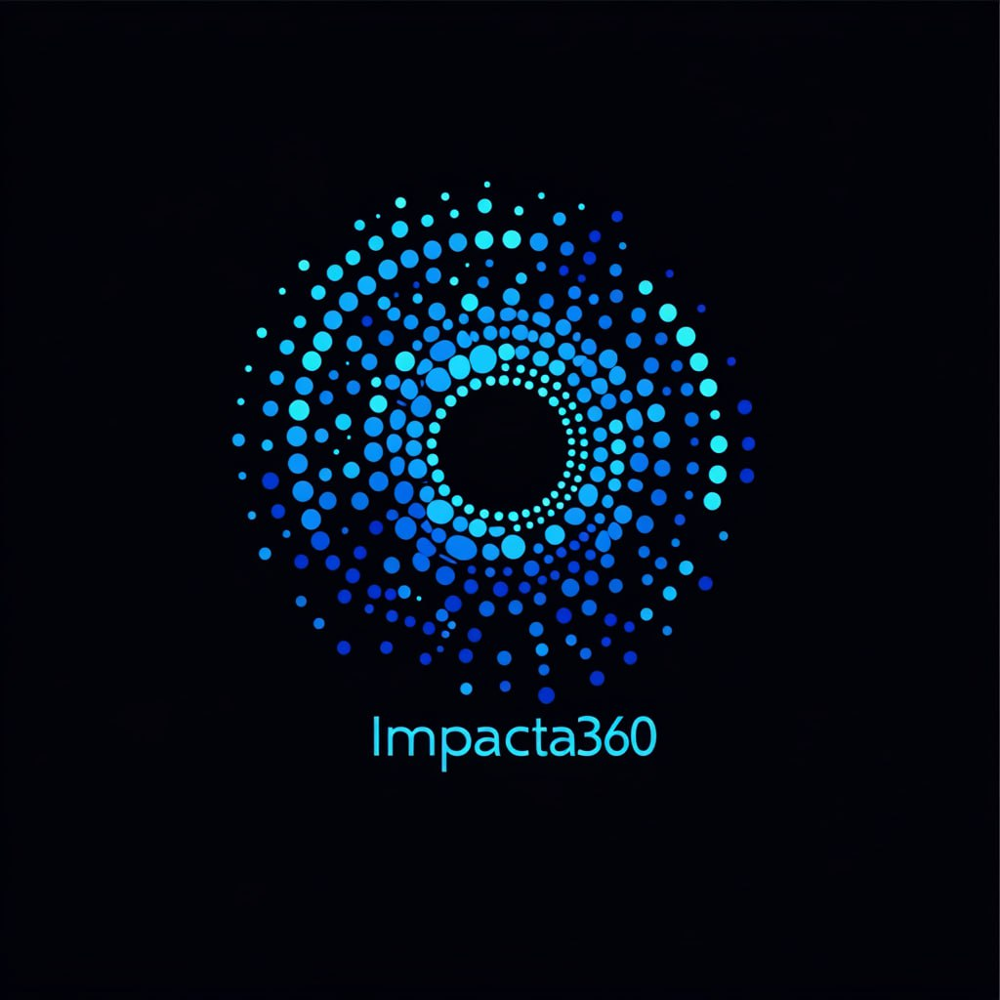
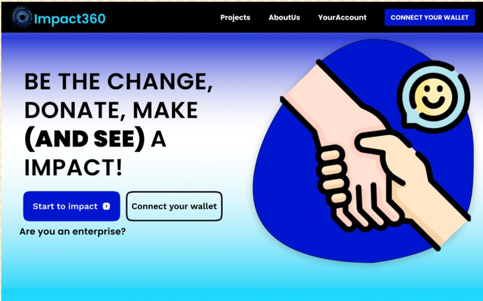

# Impacta360

<div style="text-align: center;">
  
</div>

**Impacta360** is a web3 platform that enables NGOs to manage their projects transparently and efficiently.

The platform records all donations on **Core DAO** using smart contracts to track fund usage in real-time. Every transaction, from receiving donations in Bitcoin or Ethereum to distributing resources, is registered and visible to donors. Users can support various projects and level up for exclusive benefits on the platform.

Smart contracts ensure funds are released only when specific milestones are met, offering security and transparency. Additionally, donors can download invoices for tax deductions, making the process easier and encouraging corporate social responsibility.

## Table of Contents

- [Impacta360](#impacta360)
  - [Table of Contents](#table-of-contents)
  - [Introduction](#introduction)
  - [Features](#features)
  - [Requirements](#requirements)
  - [Quickstart](#quickstart)
  - [Team](#team)
  - [Deployments](#deployments)

## Introduction

Impacta360 is built on the Core DAO blockchain, utilizing custom smart contracts to automate payments and resource management. We integrated curators to validate project outcomes, ensuring that funds are released only when agreed milestones are achieved. Additionally, we designed an intuitive interface for NGOs and donors to monitor progress and funds in real-time.

## Features

<div style="text-align: center;">
  
</div>

1. **NGO Profile Creation and Fund Requests**: Impacta360 allows NGOs to create detailed profiles and request funds for their projects. This feature enables NGOs to showcase their mission, objectives, and funding needs, making it easier for potential donors to understand and support their cause.

2. **Streamlined Donations with Invoice Generation**: Donors can contribute to NGOs directly through the platform. Upon making a donation, the necessary data is automatically uploaded to generate an invoice for fiscal purposes, simplifying the process for tax deductions and providing clear documentation.

3. **Curator-Driven Fund Release**: The release of funds is contingent on the evaluation by curators, who assess the project's progress evidence. This ensures that funds are only released when specific milestones are met, promoting accountability and transparency in project execution.

4. **Flexible Fund Delivery Options**: Impacta360 implements various types of fund delivery processes, including retro funding. This flexibility allows for different funding strategies to accommodate the unique needs of each project, ensuring optimal resource allocation.

## Requirements

Before you begin, you need to install the following tools:

- [Node (>= v18.17)](https://nodejs.org/en/download/)
- Yarn ([v1](https://classic.yarnpkg.com/en/docs/install/) or [v2+](https://yarnpkg.com/getting-started/install))
- [Git](https://git-scm.com/downloads)

## Quickstart

To get started with Scaffold-ETH 2, follow the steps below:

1. Install dependencies if it was skipped in CLI:

```
cd my-dapp-example
yarn install
```

2. Run a local network in the first terminal:

```
yarn chain
```

This command starts a local Ethereum network using Hardhat. The network runs on your local machine and can be used for testing and development. You can customize the network configuration in `packages/hardhat/hardhat.config.ts`.

3. On a second terminal, deploy the test contract:

```
yarn deploy
```

This command deploys a test smart contract to the local network. The contract is located in `packages/hardhat/contracts` and can be modified to suit your needs. The `yarn deploy` command uses the deploy script located in `packages/hardhat/deploy` to deploy the contract to the network. You can also customize the deploy script.

4. On a third terminal, start your NextJS app:

```
yarn start
```

Visit your app on: `http://localhost:3000`. You can interact with your smart contract using the `Debug Contracts` page. You can tweak the app config in `packages/nextjs/scaffold.config.ts`.

Run smart contract test with `yarn hardhat:test`

- Edit your smart contract `YourContract.sol` in `packages/hardhat/contracts`
- Edit your frontend homepage at `packages/nextjs/app/page.tsx`. For guidance on [routing](https://nextjs.org/docs/app/building-your-application/routing/defining-routes) and configuring [pages/layouts](https://nextjs.org/docs/app/building-your-application/routing/pages-and-layouts) checkout the Next.js documentation.
- Edit your deployment scripts in `packages/hardhat/deploy`

## Team

- Abi Cupido | Business developer
- José María Sosa | Blockchain engineer
- Priscila Daniela Granados Jiménez | Design

## Deployments

The following contracts were deployed on Core Dao Mainnet to allow the usage of the functionalities.

```sh
DEPLOYER: 0x72Bd1188DEA220E8267a8a75992c3e3833399C96

"Impacta360" 
tx: 0x73899eb5221d61a55110b1fbe60ff1c66838027eb11687c689da5a49fdfc0993
deployed at 0x58996D840cA5B77f7Bd25176B7f435b0c2610ca1

"USDCToken"
tx: 0x62375c20de9e7b7f0a5de6dd8721976c7c808ee170179fe8e2aba0b090035cdb
deployed at 0x9c74092E0aBd322Aa7fE50a330562277A19Cc4BE
```